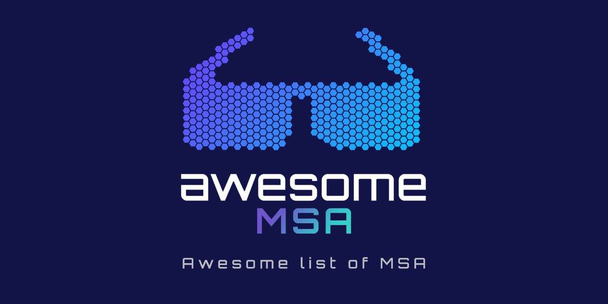

<h1 align="center">Awesome MSA</h1>

Awesome series for Microservice Architecture(MSA)

   

## Contents

- [Cloud Native Computing Foundation (CNCF)](#cloud-native-computing-foundation-cncf)
   - [Remote Procedure Call (RPC)](#remote-procedure-call-rpc)
   - [API Gateway](#api-gateway)
   - [Coordination & Service Discovery](#coordination--service-discovery)
   - [Continuous Integration & Delivery](#continuous-integration--delivery)
   - [Schedule & Orchestration](#schedule--orchestration)
   - [Service Proxy](#service-proxy)
   - [Service Mesh](#service-mesh)
   - [Container Runtime](#container-runtime)
   - [Platform](#platform)
   - [Serverless](#serverless)
   - [Observability and Analysis](#observability-and-analysis)
   - [Tracing](#tracing)
   - [Logging](#logging)
- [Architecture Patterns](#architecture-patterns)
- [Materials](#materials)
   - [Books](#books)
   - [Research Papers](#research-papers)
   - [Blog Posts](#blog-posts)
- [Community](#community)
   - [Sites](#sites)
   - [Conferences](#conferences)
   - [Speech](#speech)

## Cloud Native Computing Foundation (CNCF)

### Remote Procedure Call (RPC)

- [gRPC](https://grpc.io/)
- [Apache AVRO](https://avro.apache.org/)
- [Apache Thrift](https://thrift.apache.org/)

### API Gateway

- [Kong](https://konghq.com/)
- [EMISSARY INGRESS](https://www.getambassador.io/)
- [APISIX](https://apisix.apache.org/)

### Coordination & Service Discovery
- [etcd](https://etcd.io/)
- [CoreDNS](https://coredns.io/)
- [Apache Zookeeper](https://zookeeper.apache.org/)
- [Netflix Eureka](https://github.com/Netflix/eureka)

### Continuous Integration & Delivery
- [Argo](https://argoproj.github.io/)
- [Flux](https://fluxcd.io/)
- [Keptn](https://keptn.sh/)
- [GoCD](https://www.gocd.org/)
- [Spinnaker](https://spinnaker.io/)
- [CircleCI](https://circleci.com/)
- [Appveyor](https://www.appveyor.com/)
- [GitLab](https://about.gitlab.com/)
- [Jenkins](https://www.jenkins.io/)
- [Bamboo](https://www.atlassian.com/software/bamboo)

### Schedule & Orchestration

- [Kubernetes](https://kubernetes.io/)
- [Apache Mesos](https://mesos.apache.org/)
- [Docker Swarm](https://docs.docker.com/engine/swarm/)
- [Crossplane](https://www.crossplane.io/)

### Service Proxy

- [Envoy](https://www.envoyproxy.io/)
- [Zuul](https://github.com/Netflix/zuul)
- [NGINX](https://www.nginx.com/)
- [HAProxy](https://www.haproxy.com/)
- [Traefik](https://traefik.io/traefik)

### Service Mesh

- [Istio](https://istio.io/)
- [Linkerd](https://linkerd.io/)
- [Consul](https://www.consul.io/)

### Container Runtime

- [containerd](https://containerd.io/)
- [CRI-O](https://cri-o.io/)

### Platform

- [AWS EKS Distro](https://aws.amazon.com/ko/eks/eks-distro/)
- [Azure AKS Engine](https://github.com/Azure/aks-engine)
- [Google Kubernetes Engine](https://cloud.google.com/kubernetes-engine)
- [DigitalOcean Kubernetes](https://www.digitalocean.com/products/kubernetes)

### Serverless

- [Knative](https://knative.dev/docs/)
- [Keda](https://keda.sh/)
- [AWS Lambda](https://aws.amazon.com/lambda/)
- [Google Cloud Functions](https://cloud.google.com/functions)
- [Azure Functions](https://azure.microsoft.com/en-us/products/functions/)

### Observability and Analysis

- [Prometheus](https://prometheus.io/)
- [Grafana](https://grafana.com/)
- [Thanos](https://thanos.io/)
- [Datadog](https://www.datadoghq.com/)

### Tracing

- [Jaeger](https://www.jaegertracing.io/)
- [OpenTelemetry](https://opentelemetry.io/)
- [Grafana Tempo](https://grafana.com/oss/tempo/)
- [Zipkin](https://zipkin.io/)
- [Elastic APM](https://www.elastic.co/kr/observability/application-performance-monitoring)
- [Spring Cloud Sleuth](https://spring.io/projects/spring-cloud-sleuth/)

### Logging

- [Fluentd](https://coredns.io/)
- [Grafana Loki](https://grafana.com/oss/loki/)
- [Splunk](https://www.splunk.com/)
- [Logstash](https://www.elastic.co/kr/logstash/)
- [Elastic](https://www.elastic.co/kr/)

## Architecture Patterns

- [Saga Pattern](https://microservices.io/patterns/data/saga.html)
- [CQRS Pattern](https://microservices.io/patterns/data/cqrs.html)
- [API Gateway Pattern](https://microservices.io/patterns/apigateway.html)
- [Circuit Breaker Pattern](https://microservices.io/patterns/reliability/circuit-breaker.html)

## Architectures

- [Domain-driven design(DDD)](https://en.wikipedia.org/wiki/Domain-driven_design)

## Materials

### Books

- [Designing Data-Intensive Applications: The Big Ideas Behind Reliable, Scalable, and Maintainable Systems](https://www.amazon.com/Designing-Data-Intensive-Applications-Reliable-Maintainable/dp/1449373321/ref=sr_1_1)
- [Building Microservices: Designing Fine-Grained Systems](https://www.amazon.com/Building-Microservices-Designing-Fine-Grained-Systems/dp/1491950358/ref=sr_1_5)
- [Fundamentals of Software Architecture: An Engineering Approach](https://www.amazon.com/Fundamentals-Software-Architecture-Comprehensive-Characteristics/dp/1492043451/ref=sr_1_7)
- [Microservices Patterns: With examples in Java](https://www.amazon.com/Microservices-Patterns-examples-Chris-Richardson/dp/1617294543/ref=sr_1_9)
- [Monolith to Microservices: Evolutionary Patterns to Transform Your Monolith](https://www.amazon.com/Monolith-Microservices-Evolutionary-Patterns-Transform/dp/1492047848/ref=sr_1_11)
- [Kubernetes: Up and Running: Dive into the Future of Infrastructure](https://www.amazon.com/Kubernetes-Running-Dive-Future-Infrastructure/dp/1492046531/ref=sr_1_17)
- [Building Microservices: Designing Fine-Grained Systems](https://www.amazon.com/Building-Microservices-Designing-Fine-Grained-Systems/dp/1492034029/ref=sr_1_19)
- [Software Architecture: The Hard Parts: Modern Trade-Off Analyses for Distributed Architectures](https://www.amazon.com/Software-Architecture-Trade-Off-Distributed-Architectures/dp/1492086894/ref=sr_1_18)
- [Kubernetes in Action](https://www.amazon.com/Kubernetes-Action-Marko-Luksa/dp/1617293725/ref=sr_1_20)

### Blog Posts

- [NGINX - Introduction to Microservices](https://www.nginx.com/blog/introduction-to-microservices/)
- [Kubernetes - Consider All Microservices Vulnerable — And Monitor Their Behavior](https://kubernetes.io/blog/2023/01/20/security-behavior-analysis/)
- [Google - Microservices architecture on Google Cloud](https://cloud.google.com/blog/topics/developers-practitioners/microservices-architecture-google-cloud)
- [Netflix - Keeping Netflix Reliable Using Prioritized Load Shedding](https://netflixtechblog.com/keeping-netflix-reliable-using-prioritized-load-shedding-6cc827b02f94)
- [Netflix - The Netflix Cosmos Platform](https://netflixtechblog.com/the-netflix-cosmos-platform-35c14d9351ad)
- [Netflix - Building Netflix’s Distributed Tracing Infrastructure](https://netflixtechblog.com/building-netflixs-distributed-tracing-infrastructure-bb856c319304)
- [Airbnb - Taming Service-Oriented Architecture Using A Data-Oriented Service Mesh](https://medium.com/airbnb-engineering/taming-service-oriented-architecture-using-a-data-oriented-service-mesh-da771a841344)

## Community

### Sites

- [microservices.io](https://microservices.io)
- [CNCF landscape](https://landscape.cncf.io/)
- [Microservices Community](https://www.microservices.community/)

### Conferences

- [MICROSERVICES WORLD](https://microservicesworld.co/)
- [KubeCon / CloudNativeCon](https://events.linuxfoundation.org/kubecon-cloudnativecon-europe/)
- [DevOps Conference](https://devopscon.io/)

### Speech

- [Majestic Modular Monoliths](https://www.youtube.com/watch?v=Iz23skp-apM&list=PLcCcZh4f8l1OteFvNXSrTiJl2HxYPYuYa)
- [Mastering Chaos - A Netflix Guide to Microservices](https://www.youtube.com/watch?v=CZ3wIuvmHeM)
